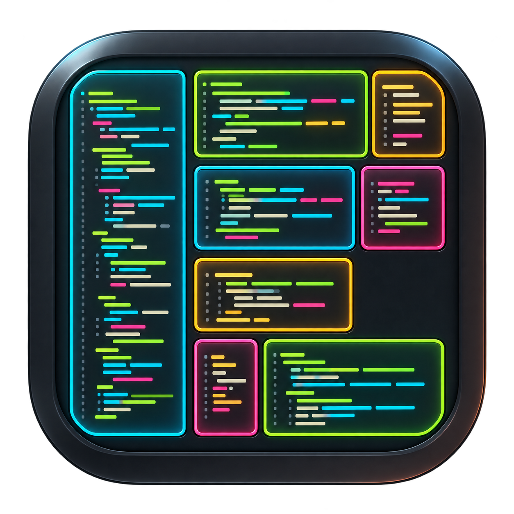

<div align="center">

<h1> FrankenCodeBrowser <code>fcb</code></h1>

**A spatial source browser with a Rust engine and a native Metal app for Apple Silicon.**

Explore the repository. Zoom into exact source. Search without losing your place.

Initial idea and visual inspiration: [Rik Arends (@rikarends)](https://x.com/rikarends?lang=en).

[](#what-exists-today)
[](#platform-and-distribution)
[](ARCHITECTURE.md)
[](LICENSE)

</div>

## Install on Mac

For Apple Silicon Macs running macOS 14 or later, [download the notarized DMG](https://github.com/Dicklesworthstone/franken_code_browser/releases/latest/download/FrankenCodeBrowser-macos-arm64.dmg), open it, and drag `FrankenCodeBrowser.app` to Applications. Or install with either command:

```sh
brew install --cask dicklesworthstone/tap/franken-code-browser
```

```sh
curl -fsSL https://raw.githubusercontent.com/Dicklesworthstone/franken_code_browser/main/scripts/install.sh | bash
```

The shell installer downloads the current release and its SHA-256 sidecar, verifies the signed app and Gatekeeper assessment, and installs to `~/Applications`. It preserves an existing installation; use `--force` when you want to replace it and keep a dated backup. Run `bash scripts/install.sh --help` from a clone for version pinning, alternate destinations, and offline installation. The [release page](https://github.com/Dicklesworthstone/franken_code_browser/releases) has the checksum and release notes.

Open FrankenCodeBrowser, choose a project folder, drag to pan, and scroll to zoom. Use `⌘F` to search exact text, click a file to read it, or choose a file-type filter from the toolbar (Markdown, Python, Rust, or custom extensions).

> [!IMPORTANT]
> This repository contains the Rust engine, C ABI bridge, headless `fcb` source tools, and the
> SwiftUI/Metal app under [`native/macos/`](native/macos/). A single checkout can build the app and
> a drag-to-Applications DMG. A notarized, stapled DMG containing the Developer ID-signed app is
> available as a public developer-preview release (the v0.1.0 disk image itself is unsigned; see
> [#1](https://github.com/Dicklesworthstone/franken_code_browser/issues/1)). A separate sandboxed Mac App Store build was submitted for review
> on September 23, 2026; no Mac App Store version has shipped yet.
> The [implementation status](IMPLEMENTATION_STATUS.md) document is a dated September 14
> snapshot; code and current qualification evidence take precedence where it has gone stale.

## Why a spatial source browser?

A file tree tells you how a project is organized, but following search hits and opening tabs can
make it difficult to remember where you are. FrankenCodeBrowser's repository atlas gives
directories and files stable places. Zooming reveals structure and then readable source; selecting
a file opens a crisp reading lens without losing its location on the map.

The Rust engine identifies source captures, layout, and search results separately. A search hit
names captured bytes, so native navigation can reject a stale or mismatched match instead of
highlighting an approximate rectangle. Broader Markdown and relationship workflows remain under
development.

## What exists today

| Surface | Current state |
|---|---|
| Rust engine and bridge | Workspace discovery, exact source captures, layout, search, saved-repository and reader services, plus a C ABI for the native shell. |
| Headless `fcb` binary | Explicit file/workspace inspection, bounded reading and exact text/byte search with versioned JSON. Bare `fcb` and human `fcb open` still report that the GUI launcher is unavailable in this binary. |
| Native app | [`native/macos/`](native/macos/) contains a SwiftUI shell with dense text parcels, directory outlines, Monokai-inspired color, Metal glyph presentation, camera gestures, exact-text search with a match count, file-type filters, a source reader and local prepared-text cache. A notarized developer-preview DMG is available. |
| Future work | Full Markdown reading, complete native accessibility/IME, code-city mode, release-grade smoothness, clean-machine distribution qualification and App Store approval remain open. |

The core interaction is deliberately continuous:

```text
Open a repository → explore its atlas → select a file → read exact source
                            ↑                              │
                            └── search / links / history ──┘
```

The browsing product does not execute project code to open a directory. Editing, builds,
debuggers and terminals are outside its initial release scope.

## How the design stays responsive

The engine retains source captures, indexes and layout identities; the native app also caches
prepared text and retains Metal glyph resources. Camera movement projects existing geometry rather
than reparsing files on every frame. Source and search operations have explicit admission limits,
partial-result states and identity checks.

This is still a performance campaign, not a finished 120 Hz claim. Physical-Mac traces show that
frame delivery and continuous zoom can stutter even when individual GPU draws are fast. See the
[release qualification plan](LOCAL_QUALIFICATION_AND_RELEASE.md) for the proof needed before a
shipping smoothness claim.

## One library, one application

```text
franken_code_browser (one public repository)
  ├── fcb library and source / search / map / UI-model crates
  ├── fcb-app: headless `fcb` command-line source tools
  ├── fcb-bridge: C ABI for the native host
  └── native/macos
       ├── SwiftUI project picker, atlas, reader and search
       ├── retained Metal glyph rendering and camera presentation
       └── franken-macos crate: typed AppKit / Metal ownership facade
```

The default library is intended to be inert: construction creates no window, runtime, thread,
database, filesystem scan or process-global handler. Hosts grant providers and explicitly supply
or delegate runtime, storage and rendering resources. Closing one view must leave its host and
other browser instances operational.

`fcb-app` now produces the headless `fcb` executable using the public library; it does not launch
the native GUI. The native app consumes `fcb-bridge` from the same workspace. The longer-term component and
consumer design is in [ARCHITECTURE.md](ARCHITECTURE.md), a design summary written before these
integrations landed.

## Shared components and ownership

| Owner | Planned role in FCB |
|---|---|
| Asupersync | Structured background work, cancellation, bounded admission and deterministic orchestration tests |
| FrankenMarkdown | All reusable highlighting, Markdown semantics, flow, source maps, fonts, text, mathematics and document display output |
| FrankenSQLite | Optional persistence with explicit connection/worker ownership and commit outcomes |
| FrankenTUI | Narrow non-terminal pane, focus and checked wide-height utilities |
| FrankenNetworkX | Selected compact directed graph views and algorithms |
| FrankenTerm | Narrow glyph-key and atlas-management primitives |
| FrankenManim | Selected retained-rendering, digest, canonical-envelope and cache primitives |
| FrankenThreeD | Qualified generational handles and resource identity primitives |
| CASS | Factored bounded evidence-selection/readiness policy for source trails |

Reusable improvements land in their owner repositories and are consumed through committed public
APIs. `fcb-document` remains a thin integration layer; it does not implement a private Markdown
engine. The first-party `franken-macos` crate and Metal renderer now live in this checkout;
the full upstream dependency and release graph still needs qualification.

The shipping graph must satisfy a strict first-party dependency rule, including transitive edges.
The plan identifies upstream factoring still needed to achieve it. There is no blanket third-party
exception for sibling dependencies. See [DEPENDENCY_CONSTITUTION.md](DEPENDENCY_CONSTITUTION.md).

## Platform and distribution

The published GUI build requires an Apple Silicon Mac running macOS 14 or later. Larger projects
benefit from more unified memory; the original performance plan uses late-model M4/M5 Macs with at
least 24 GB for its target workload, but that is not an installation requirement. Headless library
components must also work on supported non-Mac test hosts without Apple frameworks. Native Windows,
Linux, iOS and browser UIs are not initial release commitments.

The headless `fcb` executable exists in source, and the native app links this engine.
Version 0.1.0 has a physical-Mac app build and a public notarized, stapled
drag-to-Applications DMG with a checksum sidecar. The app inside is Developer ID-signed and
notarized; the v0.1.0 disk image itself carries no code signature. Quarantined first-launch and
clean-machine qualification remain open. A separate sandboxed and distribution-signed Mac App
Store build, version 0.1.0 (3), was submitted to App Review on September 23, 2026 and is waiting
for Apple's decision. It cannot be made by renaming or uploading the DMG.

The release DMG bundles the native app. The app's code signature, the image's notarization ticket,
the checksum and the app's local Gatekeeper assessment have been checked; offline first launch from a quarantined download
remains part of clean-machine qualification.

The native app currently targets macOS 14+ on Apple Silicon; the full clean-machine installation
matrix remains unverified.

## Build and install the Mac app

On macOS 14+ with Xcode command-line tools and Rust installed, clone this **one repository** and run:

```sh
git clone https://github.com/Dicklesworthstone/franken_code_browser.git
cd franken_code_browser
./scripts/install_macos_app.sh --build
```

This builds the Rust bridge and SwiftUI/Metal shell from the same checkout, then copies the app to
`~/Applications/FrankenCodeBrowser.app`. It preserves any existing installation. To build without
installing, or to inspect the app first:

```sh
APP="$(./scripts/build_macos_app.sh)"
open "$APP"
```

To make a **local-test** drag-to-Applications disk image from that same app:

```sh
./scripts/package_macos_dmg.sh --app "$APP" \
  --output "$PWD/dist/FrankenCodeBrowser-local-test.dmg" --local-test
```

Mount the DMG and drag `FrankenCodeBrowser.app` onto its `Applications` alias. `--local-test` does
not notarize the image. For a signed image, set `DEVELOPER_ID` to the exact Developer ID Application
identity reported by `security find-identity -v -p codesigning`, then use either an authenticated
`asc` CLI or a `notarytool` Keychain profile:

```sh
./scripts/package_macos_dmg.sh --app "$APP" \
  --output "$PWD/dist/FrankenCodeBrowser-notarized.dmg" \
  --identity "$DEVELOPER_ID" --notary-asc
```

Use `--notary-profile PROFILE` instead of `--notary-asc` for `notarytool`. The script signs the
app and then the disk image with that identity, waits for Apple's acceptance, staples the ticket,
and finally runs `scripts/verify_macos_dmg.sh`, which fails unless both the image and the app are
Developer ID-signed, notarized and accepted by Gatekeeper. Run that verifier on the exact file
again before uploading it to a release. See [distribution status](DISTRIBUTION.md) for the
remaining release checks. The separate App Store build and review status are recorded there as
well.

## Build and inspect the headless tools

```bash
git clone https://github.com/Dicklesworthstone/franken_code_browser.git
cd franken_code_browser
cargo build --locked -p fcb-app
cargo run --locked -p fcb-app -- --help
cargo run --locked -p fcb-app -- inspect . --workspace --json
cargo run --locked -p fcb-app -- search . --workspace --text 'Metal' --json
```

The command-line app provides bounded source tools. For example:

```text
fcb inspect /path/to/repository --workspace --json
fcb read /path/to/file.rs --offset 0 --bytes 65536 --json
fcb search /path/to/repository --workspace --text "cancel" --json --limit 50
fcb capabilities --json
fcb doctor --json
```

Those source commands are implemented in `fcb-app`; native GUI launch, `trail export`, and several
planned commands are not. See the [CLI reference](crates/fcb-app/README.md) for supported flags,
scope limits, output schema and qualification boundaries. `doctor` is a static capability report,
not a benchmark or repair command. On this development machine, Cargo builds use the configured
remote-compilation lane and require disk-pressure preflight.

## Performance objectives

The plan sets initial objectives for a qualified standard workload: roughly 100,000 files and
10 million lines, with bounded visible detail. It includes 120 Hz presentation goals, warm path
search results within 30 ms at p95, and a 3 GiB managed-resource target with a 6 GiB admission guard.

These are **targets, not achieved product SLOs**. Native GPU and frame-delivery experiments exist,
but no complete standard-workload qualification establishes the targets. Managed bytes are not
total process footprint. Stress qualification includes approximately one million files and 10–20 GiB of source, as well as
huge lines, malformed text and changing repositories. Every result must name its hardware, display,
corpus, source revision and cache state. See plan §21 and
[LOCAL_QUALIFICATION_AND_RELEASE.md](LOCAL_QUALIFICATION_AND_RELEASE.md).

## Roadmap and documentation

The plan defines 97 work packages and eight product gates, G0–G7. Substantial source, search,
cache, native renderer and UI work has landed since the last dated implementation-status snapshot.
Gate and release claims still need the specified independent verification, native usability, clean
dependency closure and distribution evidence. The immediate work is to qualify sustained zoom on
physical Macs and the published DMG's first launch on clean machines.

| Read | For |
|---|---|
| [Comprehensive plan](COMPREHENSIVE_PLAN_FOR_FRANKEN_CODE_BROWSER.md) | Full product specification, research ledger and work-package dependencies |
| [Agent instructions](AGENTS.md) | Engineering rules, shared-tree safety and verification workflow |
| [Architecture](ARCHITECTURE.md) | Component boundaries, identity and lifecycle design |
| [Dependency constitution](DEPENDENCY_CONSTITUTION.md) | Allowed closure and upstream ownership |
| [Roadmap](ROADMAP.md) | Product milestones and initial implementation order |
| [Implementation status](IMPLEMENTATION_STATUS.md) | Historical September 14 snapshot; newer code and receipts supersede it |
| [Qualification and release](LOCAL_QUALIFICATION_AND_RELEASE.md) | Semantic, native, performance and packaging evidence |
| [Security](SECURITY.md) / [Privacy](PRIVACY.md) | Root authority, untrusted source and export handling |
| [Changelog](CHANGELOG.md) | Durable repository changes |

## Limitations and common questions

**Can I run it now?** Yes. Install the notarized Mac developer preview using the DMG, Homebrew, or
shell installer above. You can also build the headless `fcb` source tools and SwiftUI/Metal app from
this checkout.

**Is it an IDE?** The planned product focuses on reading and navigation. It does not need to
execute source, compile projects or run language servers to open a directory.

**Will it understand every reference?** Exact bytes, lexical classifications, structural facts,
resolved relationships and heuristics have separate evidence levels. A highlighter is not a compiler.

**Will Markdown use a browser?** No. The design consumes native, renderer-neutral output from
FrankenMarkdown. Required flow and provenance extensions must land there first.

**Will source leave my machine?** The product contract forbids default telemetry and source
uploads. Review [privacy](PRIVACY.md) and the actual selected host/build before relying on a
specific distribution's privacy properties.

**Where should I report a problem?** Use the repository's issue templates for design defects and,
once implemented, reproducible bugs. Include the exact revision and expected behavior. Keep private
source and credentials out of public reports; see [SECURITY.md](SECURITY.md).

## About Contributions

*About Contributions:* Please don't take this the wrong way, but I do not accept outside contributions for any of my projects. I simply don't have the mental bandwidth to review anything, and it's my name on the thing, so I'm responsible for any problems it causes; thus, the risk-reward is highly asymmetric from my perspective. I'd also have to worry about other "stakeholders," which seems unwise for tools I mostly make for myself for free. Feel free to submit issues, and even PRs if you want to illustrate a proposed fix, but know I won't merge them directly. Instead, I'll have Claude or Codex review submissions via `gh` and independently decide whether and how to address them. Bug reports in particular are welcome. Sorry if this offends, but I want to avoid wasted time and hurt feelings. I understand this isn't in sync with the prevailing open-source ethos that seeks community contributions, but it's the only way I can move at this velocity and keep my sanity.

## License

[MIT License with OpenAI/Anthropic Rider](LICENSE), matching the owner's example repositories.
The rider is part of the license; see the exact terms. Future fonts, assets and dependencies must
retain their own license and provenance records.
